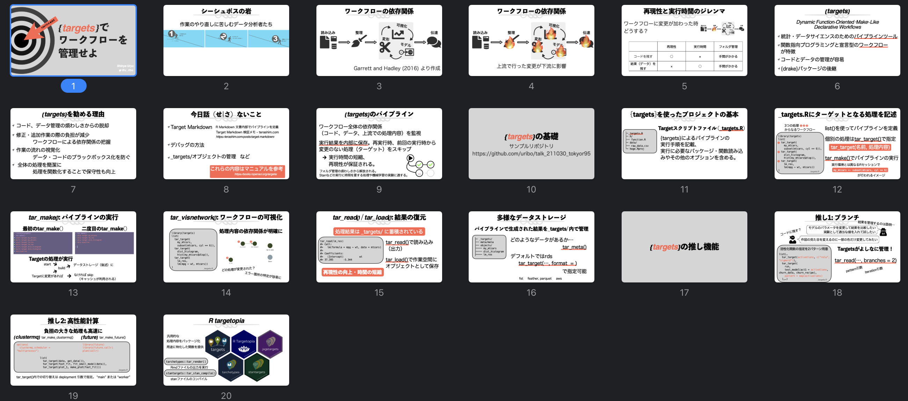
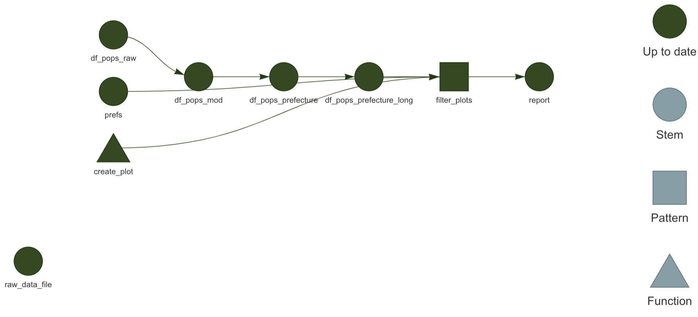

# {targets}でワークフローを管理せよ

[Tokyo.R#95\@online](https://tokyor.connpass.com/event/225967/) での発表資料置き場

targetsを使った分析の例として、人口動態調査のデータを整形し、可視化する処理を行います。
ワークフローの全体像は[`_targets.R`](https://github.com/uribo/talk_211030_tokyor95/blob/master/_targets.R)を見てください。

## Slide

[[Speaker Deck](https://speakerdeck.com/s_uryu/workflow-management-with-targets)] [[PDF](https://github.com/uribo/talk_211030_tokyor95/blob/master/slide/20211030_tokyor95.pdf)] [[Keynote](https://github.com/uribo/talk_211030_tokyor95/blob/master/slide/20211030_tokyor95.key)]



## Data

[人口動態調査](https://www.e-stat.go.jp/statistics/00450011)

- `data-raw/2015_mi040001.csv`: 年次・都道府県・性別人口 (1) 総数

## Targetsプロジェクトの構成例

``` r
├── _targets.R ... パイプラインの定義
├── R/
├──── functions.R ... パイプライン中のターゲット実行処理を関数化したもの
├── data/
├──── raw_data.csv
└── index.Rmd
```

### _targets.Rへのワークフローの宣言

``` r
library(targets)
source("R/functions.R") # 使用する関数の呼び込み
tar_option_set(packages = c("dplyr", "ggplot2")) # 使用するパッケージの指定

list( # リストにターゲット（処理）を記述
  tar_target(
    処理の名前,
    処理の内容 (Rコマンド)
  ),
  tar_target(
    処理の名前その2,
    処理の内容その2
  ),
  ...
)
```

このリポジトリの例では次のターゲットが含まれます。

1. データの用意
    1. ローカルのファイルの変更を検出可能にする
2. データファイルを読み込む
3. データの加工
    1. データの列名を変更し、特定の列への処理を加える
    2. 都道府県コードと名前を複数の列に分ける
    3. データを縦長に変形させる
4. データの可視化
    1. 対象の地域を指定
    2. グラフの作成
5. レポートの生成



## Links

-   <https://github.com/wlandau/targets-minimal>

-   <https://github.com/wlandau/r-lille-2021>

- R のパイプラインツール targets を使う意義 <https://terashim.com/posts/targets-r-pipeline/>

- Target Markdown 検証メモ <https://terashim.com/posts/target-markdown/>
